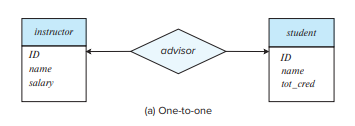
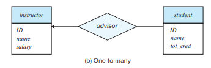
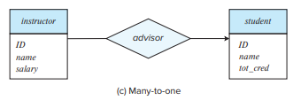
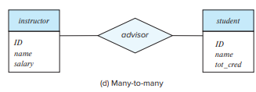
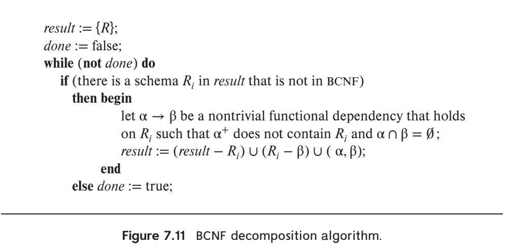
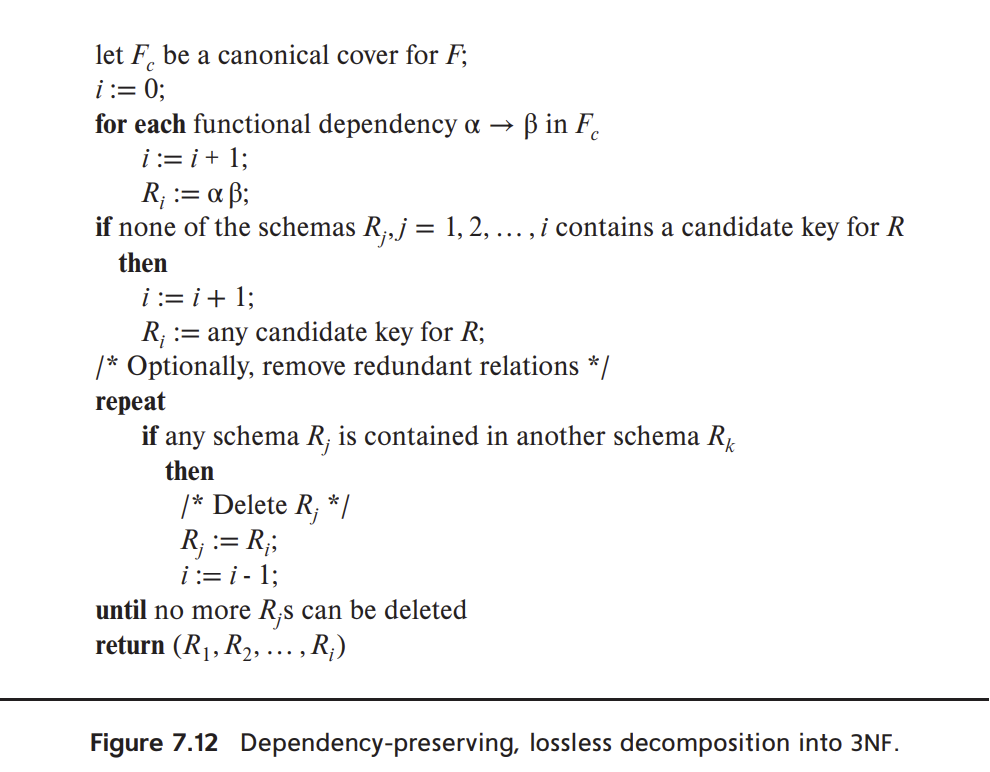
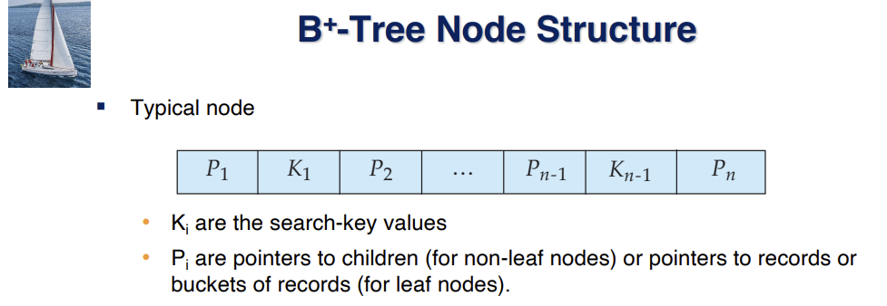

# Final Study Guide
---
List of things to study from recording:
1. Outer join (Symmertric difference through symmetric difference)
2. SQL Set opertaions
   1. Aggrigate handling null
   2. Nested Querry
   3. Integrity constraints
3. ERD Design Cardinality
4. JDBC
   1. Update table through jdbc with pre-written code. 
5. Writing Triggers to include some integrity constraint (PL/SQL)
6. OLAP
   1. Most likely test cube
7. Normalization decomposition algorithm
   1. BCNF
   2. 3NF 
   3. (He says Memorization is not important but practice is the most important)
8. Functional dependencies
   1. Find primary key/canidate keys
   2. 3 armstrong axioms
9. Depenedency preservation / Losslessness 
10. Storage
    1.  Formulas
        1.  Cost of accessing data
        2.  Seeking time
        3.  rotational time
        4.  buffer within memory
    2. RAID 
 11. Index types
     1.  B+ tree index
         1.  How to operate on B+ tree
     2.  Hash index
     3.  Sparse / dense index
     4.  Primary / secondary index
     5.  Advantages or disadvantages 
 12. Querry processing 
     1.  Is the right algorithm used for the right situation 
     2.  Be able to connect formuals to real life connection
11. Recovery algorithm 
12. Async properties of transactions
13. Stable storage / checkpoints 
14. Concurrency 
    1.  Two-phase locking
    2.  Granularity
    3.  Deadlock
15. Phantoms 
16. Distributed and parallel querry processing

---
<!-- TODO add data for all joins -->
## 1 Outer join 

Outer join can be used for symmetric difference between the opposing side. Natually biasing the side in the description of 

* Left outer join
* Right outer join
* Full outer join

`natural left outer join` is the correct syntax of outer natual join

With this syntax, the side of the comparison that is used in the name will exist as the full table, and each of the other comparisons will have null when not populated.

## 2 SQL Set Operations

### Aggrigate Handling null

Things like `not(1<null)` would evaulate to true 

* **and**: The result of true **and** unknown is unknown, false **and** unknown is false, while unknown **and** unknown is unknown.
* **or**: The result of true **or** unknown is true, false **or** unknown is unknown, while unknown **or** unknown is unknown.
* **not**: The result of **not** unknown is unknown.

Any situation where the the outcome of the logical expression is explicity given by the other term, the solution will be unknown. 

In a aggrigation querry, null values are considered to be ignored in all situations except `count(*)`

### Nested Querry

Nested subquerries are tools used for performing set based operations by creating additional groups within the where clause of another querry. 

Using commands such as `in` and `not in` subquerries can be used for comparison

```sql
select distinct course id
from section
where semester = 'Fall' and year= 2017 and
course id not in (select course id
                from section
                where semester = 'Spring' and year= 2018);
```

Methods such as 
* all 
* some >1
* exists >=1
* not exists
* except 
* unique
---
## 2.5 Integrity Constraints 
Integrity constraints ensure changes made to the datbase by authorized users do not result in a loss of data consistency. Thus, integrity constraints guard against accidental damage to the datbase.

**Basic forms of integrity constraints**
* not null
* unique
* check(\<predicate\>)

``` sql
name varchar(20) not null
budget numeric(12,2) not null
```

**Check Predicate**
```sql
create table section
    (course id varchar (8),
    sec id varchar (8),
    semester varchar (6),
    year numeric (4,0),
    building varchar (15),
    room number varchar (7),
    time slot id varchar (4),
    primary key (course id, sec id, semester, year),
    check (semester in ('Fall', 'Winter', 'Spring', 'Summer')));
```
---
## 3 ERD Design
### Cardinality

* One to one
  * An entity in A is associated with at most one entity in B, and an entity
in B is associated with at most one entity in A.
    
* One to many
  * An entity in A is associated with any number (zero or more) of entities in B. An entity in B, however, can be associated with at most one entity in A.
    
* Many to one
  * An entity in A is associated with at most one entity in B. An entity
in B, however, can be associated with any number (zero or more) of entities in A
    
* Many to many
  * An entity in A is associated with any number (zero or more) of
entities in B, and an entity in B is associated with any number (zero or more) of
entities in A
    

---

## 4. JDBC 

### Updating Table in JDBC 

```java
  public static void main(String[] args) {
    try (
         Connection con=DriverManager.getConnection("jdbc:oracle:thin:@edgar1.cse.lehigh.edu:1521:cse241", user_name, new String(pwd));
         Statement s=con.createStatement();
         ) {
           String q;
           ResultSet result;
           int i;
           q = "create table enemies2 (dog_name varchar(20), weight numeric(9,2))";
           i = s.executeUpdate(q);
           System.out.println ("value returned: " + i);
         } catch(Exception e){e.printStackTrace();}
  }
```
---

## 5 Writing Triggers to include integrity contraints


**Trigger** is a statement that the system executes automatically as a side effect of a modification to the database 

1. Specify when a trigger is to be executed. Broken up into an event  and condition
2. Specify the actions to be taken when the trigger executes

Triggers can be used to implement integrity constaints that are not possible through nomral sql commands 

Example of trigger update
```sql 
    create trigger timeslot check1 after insert on section
    referencing new row as nrow
    for each row
    when (nrow.time slot id not in (
            select time slot id
            from time slot)) /* time slot id not present in time slot */
    begin
        rollback
    end;

    create trigger timeslot check2 after delete on timeslot
    referencing old row as orow
    for each row
    when (orow.time slot id not in (
            select time slot id
            from time slot) /* last tuple for time slot id deleted from time slot */
        and orow.time slot id in (
            select time slot id
            from section)) /* and time slot id still referenced from section*/
    begin
    rollback
    end;
```

---
## 7 Normalization Decomposition

### 1. BCNF
A given table is in BCNF if and only if it is in 3NF and for each non-trivial FD X->Y, X is a super key (i.e. X<sup>+</sup> covers all attributes in table). In other words, it is 3NF form but the first option/condition for 3NF is necessary.
BCNF doesn't ensure dependency preservation (unlike 3NF), but it guarantees a lossless join.



### 2. 3NF
A table is in 3NF iff for each non-trivial FD at least one of the following holds:
   1. LHS is super key
   2. RHS is prime attribute
(i.e. is in 2NF and no transitive dependencies for non-prime attributes. NPA -> NPA not allowed). 3NF ensures dependency preservation but there is a possibility for redundancy.




---
## 8 Functional Dependencies

### 1. Find Candidate Keys
The candidate key is a minimal set of attributes that can determine every attribute in the table. This can be seen by finding the closure of candidate key (CK<sup>+</sup>). A method for finding a candidate key is to start with the closure of all attributes (Ex: ABCDEF+), then remove attributes incrementally that can be found from the remaining attributes' FDs.

### 2. Armstrong Axioms

## 9 Dependency Preservation and Losslessness

### 1. Dependency Preservation
A decomposition is dependency preserving if the closure of (F<sub>1</sub> U F<sub>2</sub> U ... F<sub>n</sub>) is equivalent to the closure of F. F<sub>1</sub>,F<sub>2</sub>.. being the set of FD's that include only attributes in their respective tables.. . In other words, can the decomposed tables' FDs be rewritten (using Armstrong axioms) to hold the same logic of original set of FDs, F?

### 2. Losslessness
A decomposition is lossless if the union of all tables ( ∀ R<sub>i</sub>), equals the original table R. This is held if every table is connected through a foreign and primary key, which then can determine all attributes in each R<sub>i</sub>.


---

## 11 Index Types

### 1.  B+ tree index
B+ trees have multilevel indexing, where nonleaf nodes of the tree form a multilevel sparse index on the leaf nodes. Each node can hold up to n pointers. A leaf node has between ceiling((n-1)/2) and n-1 values.


### 2.  How to operate on B+ tree
Insertion: Traverse down tree until you find leaf node where key value should appear after. Insert the key and pointer of new insertion in the node if it has less than n-1 key-values. Else resize leafs and parents according to the B+ rules involving the specified limits of pointers and values a given node can have.
[B+ Tree Video](https://youtu.be/aZjYr87r1b8?t=1639)
[Inserting](https://www.youtube.com/watch?v=47DUnfH1D0w)
[Deleting](https://www.youtube.com/watch?v=YZECPU-3iHs)

### 3.  Hash index

### 4.  Sparse / dense index

### 5.  Primary / secondary index

### 6.  Advantages or disadvantages 
